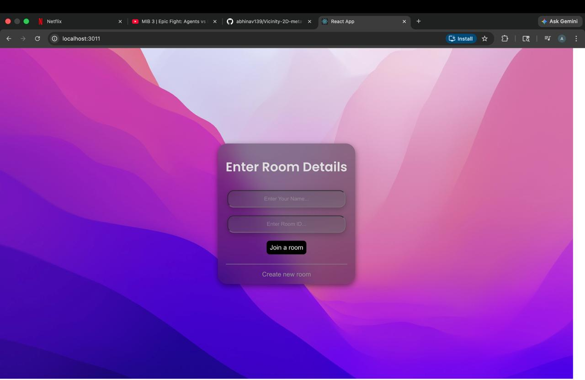
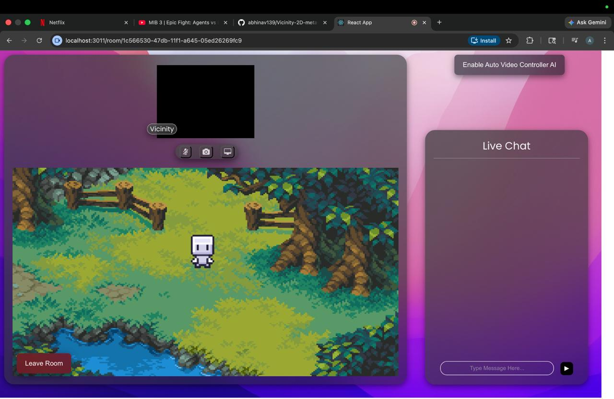
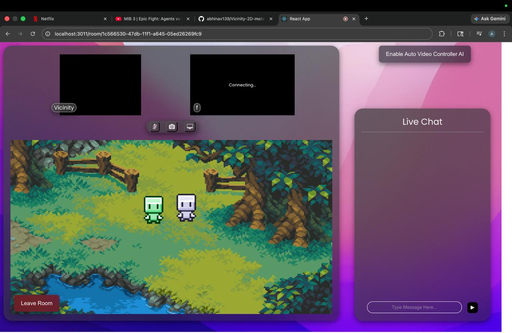

#  Vicinity

**Vicinity** is a real-time multiplayer video chat application built within a lightweight 2D virtual environment.  
Users navigate a shared space where video communication is triggered automatically based on proximity.

Built using **React, Node.js, Socket.io, and WebRTC**.

---

##  Features

-  Real-time avatar movement (WASD / Arrow keys)  
-  Proximity-based video communication  
-  Audio, camera, and screen sharing support  
-  Integrated real-time chat system  
-  Room-based multiplayer architecture  

---

##  Screenshots

###  Room Join


---

###  Single Player View


---

###  Two Players Interaction


---

##  Installation

Install dependencies for both server and client:

```bash
cd server && npm install
cd client && npm install
```

##  Run

### Production
```bash
cd server/client
NODE_OPTIONS=--openssl-legacy-provider npm run build
cd ..
NODE_ENV=production node server.js
```
Open: http://localhost:3001

##   Development

# Terminal 1
```bash
cd server && node server.js
```

# Terminal 2
```bash
cd server/client && npm start
```

Open: http://localhost:3001

##  Usage
```bash
1. Create or join a room using a Room ID  
2. Move using **WASD** or **Arrow keys**  
3. Approach other users to automatically start video  
4. Use on-screen controls for mic, camera, and chat  
```

## Structure
```
Vicinity/
├── server/
│   ├── client/
│   └── server.js
├── screenshots/
└── README.md
